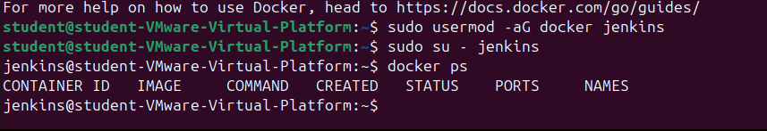

Vul onderstaande aan met de antwoorden op de vragen uit de readme.md file. Wil je de oplossingen file van opmaak voorzien? Gebruik dan [deze link](https://github.com/adam-p/markdown-here/wiki/Markdown-Cheatsheet) om informatie te krijgen over
opmaak met Markdown.

a) 

    1. Voeg jenkins toe aan de docker groep.
    2. Door sudo su - jenkins te doen krijgt de jenkins user permanent sudo rechten zodat hij docker commands zonder sudo kan uitvoeren.
